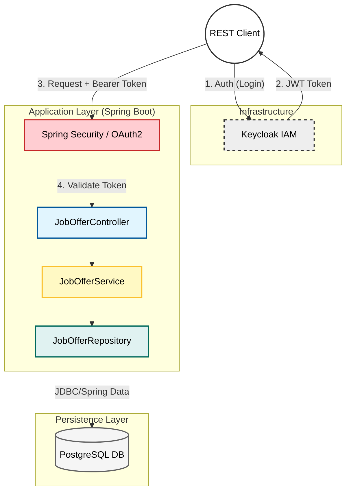
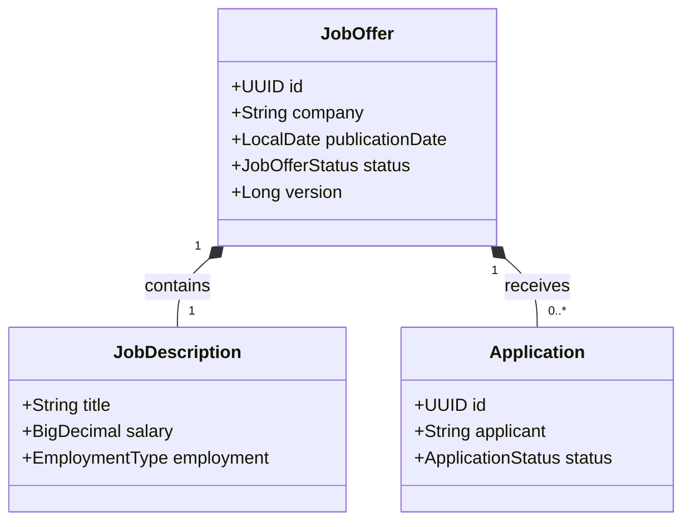

# JobConnect Backend

[](https://openjdk.org/)
[](https://spring.io/projects/spring-boot)
[](https://www.docker.com/)
[](https://www.keycloak.org/)
[](https://kubernetes.io/)


> Eine cloud-native Backend-Referenzimplementierung für eine Job-Vermittlungsplattform.
> Entwickelt im Rahmen des Studiums an der Hochschule Karlsruhe.

## 📋 Projektübersicht

JobConnect ist ein beispielhaft implementiertes Backend-System, das moderne **Enterprise-Patterns** mit **Cloud-Native-Technologien** verbindet. Das System ermöglicht die Verwaltung von Stellenangeboten und Bewerbungsprozessen über eine gesicherte RESTful API.

Der Fokus dieses Projekts lag nicht nur auf funktionaler Korrektheit, sondern auf **Nicht-funktionalen Anforderungen** wie:
* **Wartbarkeit:** Durch strikte Schichtenarchitektur und DTO-Pattern.
* **Sicherheit:** Durchgängige OAuth2/OIDC-Implementierung.
* **Datenintegrität:** Vermeidung von Lost Updates und Race Conditions.
* **Betriebssicherheit:** Infrastructure-as-Code und Observability.

---

## 🏗️ Systemarchitektur

Das System folgt einer **Layered Architecture** (Controller, Service, Repository) und integriert einen externen Identity Provider (Keycloak) für das Access Management.



### Datenmodell (Entity Relationship)

Das Domänenmodell zentriert sich um das Aggregate Root `JobOffer`.



---

## 🛠️ Technologie-Stack

Das Projekt nutzt aktuelle Standards und Preview-Features des Java-Ökosystems.

| Bereich | Technologie / Tool | Beschreibung |
| --- | --- | --- |
| **Core** | **Java 25** | Nutzung von Preview Features für modernen Code. |
| **Framework** | **Spring Boot 3.x** | WebMVC, Data JPA, Validation, Mail. |
| **Security** | **Keycloak & OAuth2** | OIDC Provider, JWT Handling, Resource Server. |
| **Database** | **PostgreSQL & Flyway** | Relationale DB mit versionierten Schema-Migrationen. |
| **API Docs** | **OpenAPI (Swagger)** | Automatische Generierung der API-Spezifikation. |
| **Testing** | **JUnit 5 & Mockito** | Unit-Tests, Integrationstests (SpringBootTest). |
| **Quality** | **SpotBugs, PMD, Checkstyle** | Statische Codeanalyse & NullAway (Null-Safety). |
| **Observability** | **Micrometer & Zipkin** | Distributed Tracing und Prometheus Metriken. |

### Infrastructure as Code (IaC)

Die Infrastruktur ist vollständig deklarativ definiert und befindet sich im Verzeichnis `extras/`.

| Tool | Verwendungszweck |
| --- | --- |
| **Docker Compose** | Lokale Entwicklungsumgebung (DB, Keycloak, App). |
| **Kubernetes (K8s)** | Deployment-Manifeste, Services und Ingress-Konfiguration. |
| **Helm Charts** | Paketierung der Anwendung für K8s-Cluster. |
| **Terraform** | Provisionierung der Cloud-Ressourcen. |
| **Pulumi** | Alternative Infrastruktur-Definition (TypeScript/Java). |

---

## Design-Entscheidungen & Patterns

* **Model View Controller (MVC):** Strukturierung der Software in drei logische Einheiten.
* **Optimistic Locking:** Verwendung von `@Version` Feldern in JPA-Entitäten, um *Lost Updates* bei parallelen Zugriffen zu verhindern.
* **DTO Pattern:** Strikte Trennung von Persistenzschicht und API durch Data Transfer Objects (DTOs) und Mapper (MapStruct).
* **Fail-Fast Validierung:** Eingangsdaten werden direkt am Controller mittels Jakarta Validation geprüft.
* **Pagination:** Performance-Optimierung durch Paging bei Listen-Endpunkten.
* **Lazy Logging:** Ressourcenschonendes Logging nur bei Bedarf.

---

## Installation & Start

### Voraussetzungen

* **JDK 25** (Preview Features müssen aktiviert sein)
* **Docker Desktop** (oder kompatible Runtime)
* **Maven** (Wrapper `mvnw` liegt bei)

### Lokales Deployment

1. **Repository klonen**
```bash
git clone [https://github.com/niko1405/jobconnect-backend.git](https://github.com/niko1405/jobconnect-backend.git)
cd jobconnect-backend

```


2. **Infrastruktur starten** (PostgreSQL & Keycloak)
```bash
cd extras/compose
docker-compose up -d

```


3. **Anwendung starten**
```bash
cd ../..
./mvnw spring-boot:run

```


**Zugriffspunkte:**

* API: `http://localhost:8080`
* Swagger UI: `http://localhost:8080/swagger-ui.html`
* Keycloak Admin: `http://localhost:8081`

---

## 📄 Lizenz & Copyright

Copyright (C) 2016 - present Jürgen Zimmermann, Hochschule Karlsruhe.
Dieses Projekt steht unter der **GNU General Public License v3.0**.

```

```
