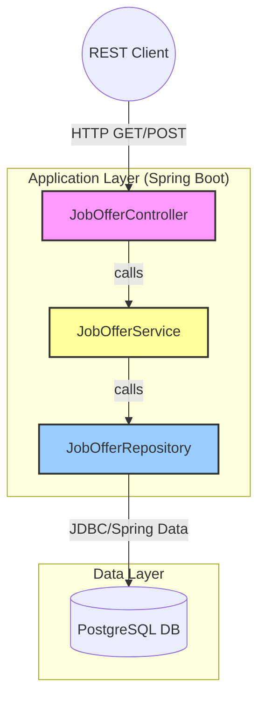
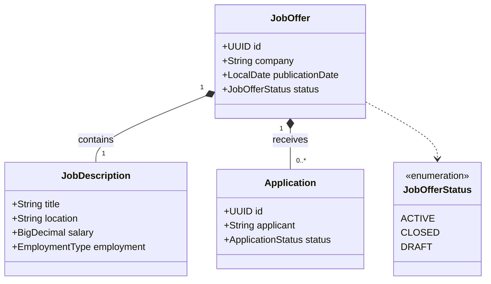

# JobConnect Backend

[](https://openjdk.org/)
[](https://spring.io/projects/spring-boot)
[](https://www.docker.com/)
[](https://www.terraform.io/)
[](https://kubernetes.io/)

## 📖 Über das Projekt
**JobConnect** ist eine Backend-Lösung für eine Job-Vermittlungsplattform, entwickelt als Semesterprojekt an der Hochschule Karlsruhe.

Das System stellt eine RESTful API bereit, um Stellenangebote (`JobOffers`) und Bewerbungen (`Applications`) zu verwalten. Besonderer Fokus lag auf einer sauberen Schichtenarchitektur, Typsicherheit und modernen Deployment-Strategien mittels Infrastructure-as-Code.

---

## 🏗️ Architektur
Das Projekt folgt einer klassischen Schichtenarchitektur (Controller → Service → Repository), um die Verantwortlichkeiten sauber zu trennen.



## 📂 Datenmodell (Entity Relationship)

Ein `JobOffer` (Stellenangebot) ist die zentrale Entität, die eine `JobDescription` enthält und mehrere `Applications` (Bewerbungen) empfangen kann.



---

## 🚀 Technologie-Stack

### Core Backend

* **Sprache:** Java 21
* **Framework:** Spring Boot (Web, Data JPA, Validation)
* **Datenbank:** PostgreSQL
* **Architektur:** REST, Layered Architecture
* **Build Tool:** Maven

### Infrastructure & DevOps

* **Container:** Docker & Docker Compose
* **Orchestrierung:** Kubernetes (K8s) & Helm Charts
* **IaC:** Terraform & Pulumi
* **CI/CD:** GitHub Actions (Vorbereitet)

---

## 🛠️ Installation & Setup

### Voraussetzungen

* JDK 21
* Docker & Docker Compose
* Maven (optional, da `mvnw` enthalten ist)

### Lokal starten (Quickstart)

Um die Anwendung inklusive Datenbank lokal zu starten:

1. **Repository klonen**
```bash
git clone [https://github.com/niko1405/jobconnect-backend.git](https://github.com/niko1405/jobconnect-backend.git)
cd jobconnect-backend

```


2. **Anwendung bauen** (Tests überspringen für schnelleren Build)
```bash
./mvnw clean package -DskipTests

```


3. **Infrastruktur starten (PostgreSQL)**
```bash
cd extras/compose
docker-compose up -d

```


4. **App starten**
   Gehe zurück ins Hauptverzeichnis und starte die App:
```bash
cd ../..
./mvnw spring-boot:run

```


Die API ist nun unter `http://localhost:8080` erreichbar.

---

## ☁️ Infrastructure-as-Code (IaC)

Die Infrastruktur ist vollständig als Code definiert und befindet sich im `extras/` Ordner. Dies demonstriert verschiedene Wege des Cloud-Deployments:

| Tool | Pfad | Beschreibung |
| --- | --- | --- |
| **Terraform** | `extras/terraform` | Deklarative Provisionierung der Cloud-Ressourcen. |
| **Pulumi** | `extras/pulumi` | Infrastruktur-Definition mittels TypeScript/Java. |
| **Kubernetes** | `extras/kubernetes` | Manifeste für Deployments, Services und Ingress. |
| **Helm** | `extras/helm` | Helm Charts für das Paketmanagement im Cluster. |

---

## 📄 Lizenz

Der Quellcode basiert auf einem Template der Hochschule Karlsruhe (Prof. Jürgen Zimmermann) und steht unter der **GNU General Public License v3.0**.

```

```
